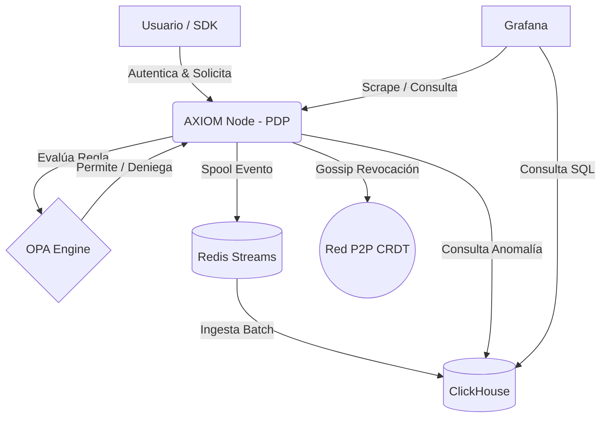

# AXIOM: Zero Trust Architecture


AXIOM es un sistema de control de acceso Zero Trust de alto rendimiento diseñado para entornos distribuidos. Integra la evaluación de políticas mediante OPA (Rego), almacenamiento analítico con ClickHouse, y una red P2P (Gossip) apoyada en CRDTs para una propagación veloz de revocaciones.

## 🚀 Arquitectura



## 🎥 Demostración (SPA)


## 🛠️ Instalación y Uso

Instrucciones literales para levantar el proyecto:

1. Clona el repositorio.
2. Ejecuta:
   ```bash
   docker-compose up -d --build
   ```
3. Ve a [http://localhost:3000](http://localhost:3000) para ver la SPA en funcionamiento.
4. Ve a [http://localhost:3001](http://localhost:3001) para explorar el Dashboard de Grafana con métricas en tiempo real.

Para ejecutar una prueba de estrés (1000 RPS):
```bash
python load_test.py
```

## 📚 Documentación

Revisa la [Arquitectura](ARCHITECTURE.md) detallada y nuestros [Architecture Decision Records (ADRs)](docs/adr/).
